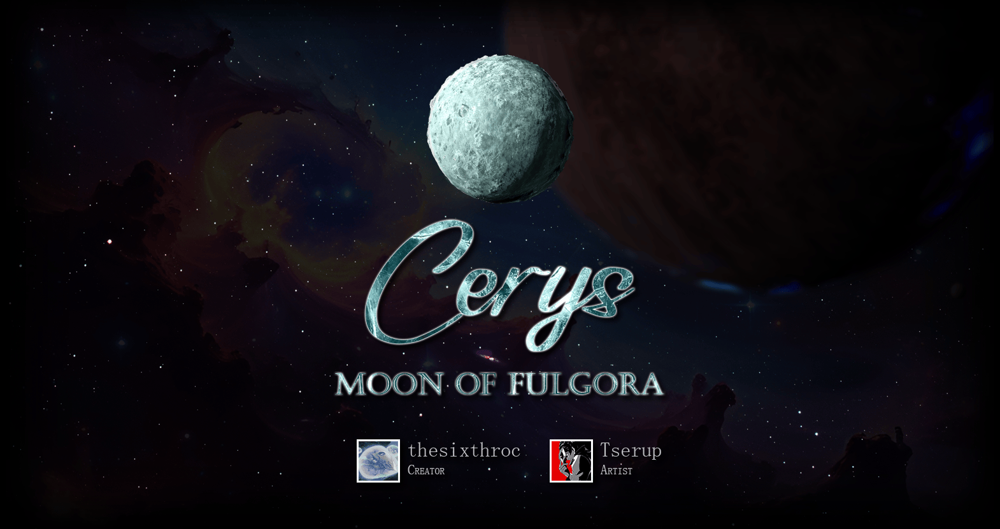
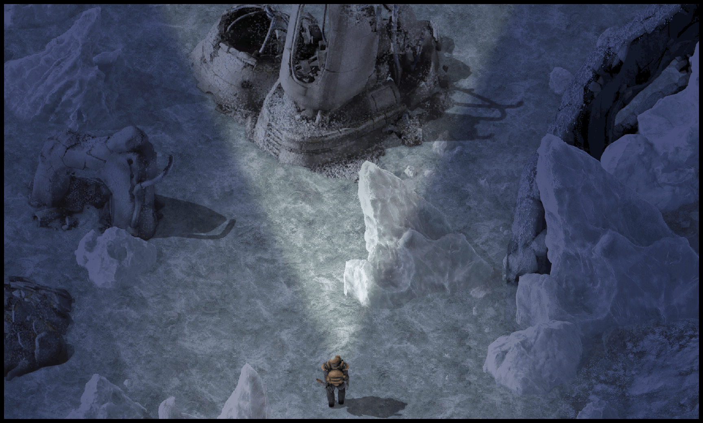

# Cerys

You discover Cerys, a mysterious moon of Fulgora whose ancient secrets lie frozen below a thick layer of dry ice.

A gentle solar wind drifts overhead under Fulgora's magnetic influence. As you touch down, methane ice scatters into the airless atmosphere. Asteroids wander overhead.

You glimpse frozen structures lodged throughout the surface. Though made of new materials, they bear the hallmarks of the Fulgorans. As you explore, it becomes apparent that without lightning, they found another source of power.

## Features

- Brand new gameplay: repair ancient wrecks, defrost your factory with a new mechanic, and more. Unlike planets, the play area is finite.
- Traditional mining is combined with a novel recycling chain based on nuclear plant components. Iron is a scarce resource (despite several methods to obtain it), providing new challenges in the early-game.
- Cargo pods cannot drop resources onto Cerys without a specific technology.
- Ultimately, the moon is a set of puzzles and secrets that long-time Factorio players will enjoy.

There are no changes to vanilla content, so it is simple to include this mod in existing saves.

## Notes

- Rewards to the rest of the game are venting and flaring towers, plus plutonium rocket fuel, ammo and portable reactor. These rewards are intentionally modest, as Cerys is a mostly self-contained experience.
  - The mod contains a 2.0 port of [GotLag's Flare Stack](https://mods.factorio.com/mod/Flare%20Stack) which is higher-quality than those we could find. This is planned to be extracted into a separate mod.
- We didn't originally set out to make a full 'planet'. This mod spun out of a thesixthroc's explorations to revamp Fulgora for [Space Age: Hardcore Mode](https://mods.factorio.com/mod/Space-Age-Hardcore-Mode).
- I have an interest in professional game design, so feel free to reach out for potential collaborations. I also enjoy talking to players, so please feel free to reach out on Discord.
- If you can't heat anything up, take the iron stick out.

## Localization

- English, Chinese.
- To help translate more languages, submit a pull request at [GitHub](https://github.com/danielmartin0/Cerys-Moon-of-Fulgora).

## Reviews

- "one of the best mods ever made. every recipe has a purpose. does not waste your time" — notnotmelon

## Credits

- Gameplay and code by thesixthroc.
- Art by Tserup.
- Special thanks to playtesters rjdunlap, Preceti, and especially NekoBaron and notnotmelon for feedback and discussion.
- Some assets are adapted from open-source materials. See Credits.md for details.
